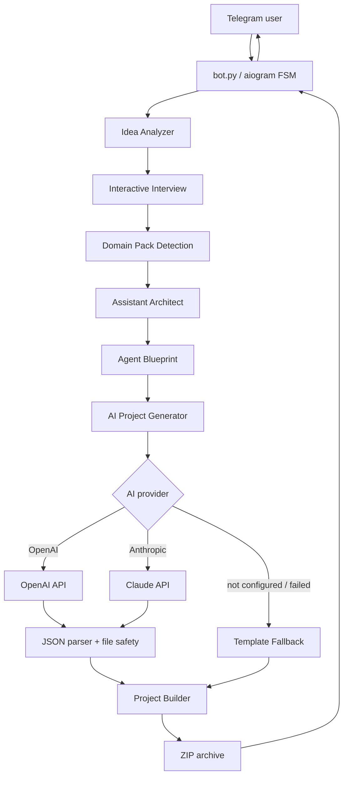

# AI Creator

[](https://github.com/yersaskarov/ai-creator/actions/workflows/tests.yml)

AI assistant builder that turns work problems into generated Telegram bots and AI-agent starter projects.

Status: v0.6 prototype  
Tests: 124 passing  
Docker: supported  
CI: GitHub Actions  
Stage: controlled pilot / portfolio project

## What It Is

AI Creator is an assistant builder platform prototype. It is no longer just a Telegram bot generator: it takes a work problem written in plain language, asks clarifying questions, detects the professional domain, builds an Agent Blueprint, and generates a ZIP project with starter code.

The goal is to help a user move from "I have a repetitive work problem" to a practical generated assistant scaffold with code, prompts, configuration examples, and a README.

## Why It Exists

Most people describe automation needs as messy workplace stories, not as software specs. AI Creator turns that raw problem statement into a structured generation pipeline:

- it analyzes the idea;
- asks focused follow-up questions;
- detects the domain;
- applies domain knowledge;
- designs the assistant architecture;
- builds an Agent Blueprint;
- generates a starter project;
- packages the result as a ZIP archive in Telegram.

This makes generated projects more grounded than a generic one-shot prompt.

## Example Use Cases

Zabbix Camera Monitoring Agent:

- Problem: cameras go down and disappear from reports after 5 days.
- Generated direction: track current status, `first_seen_down`, long-down cameras, and send Telegram summaries.

Logistics Document Bot:

- Flow: DOCX template -> data replacement -> PDF -> stamp/signature.
- Useful for supplier documents, shipment paperwork, and repeated document generation.

Jira Notification Bot:

- Flow: new issues, status changes, comments -> Telegram notifications.
- Useful for teams that need fast ticket lifecycle updates.

Internal Knowledge Assistant:

- Flow: FAQ/docs/internal knowledge base -> answers with source references.
- Useful for routine employee questions where unknown answers should be refused instead of invented.

## Current Pipeline

```text
User problem
   |
   v
Idea Analyzer
   |
   v
Interactive Interview
   |
   v
Domain Pack Detection
   |
   v
Assistant Architect
   |
   v
Agent Blueprint
   |
   v
AI Project Generator
   |
   v
Project Builder
   |
   v
ZIP archive
```

If Claude/OpenAI is not configured, times out, returns invalid JSON, or fails validation, AI Creator falls back to safe built-in templates.

## Current Capabilities

- Telegram bot built with `aiogram 3`.
- Guided FSM questionnaire.
- Interactive interview flow for custom ideas.
- Rule-based idea analysis.
- Domain Pack detection.
- Domain-aware assistant architecture.
- Agent Blueprint generation.
- Claude and OpenAI provider support.
- Template fallback mode.
- Python and JavaScript/TypeScript starter projects.
- Safe file writing and ZIP packaging.
- Access control through `ALLOWED_TELEGRAM_IDS`.
- Per-user generation lock.
- Docker and Docker Compose support.
- GitHub Actions checks.
- 124 passing tests.

## Domain Packs

Domain-specific knowledge lives in `domain_packs.py`. Each pack defines keywords, assistant type, interview questions, recommended stack, integrations, and production considerations.

Current packs:

- Logistics.
- Document Automation.
- Jira Assistant.
- Zabbix Monitoring.
- Internal Knowledge Assistant.
- Generic fallback.

## Agent Blueprint

The Agent Blueprint is the main product specification passed into generation. It includes:

- problem statement;
- target users;
- inputs;
- outputs;
- agent actions;
- integrations;
- data storage;
- security notes;
- deployment notes;
- acceptance criteria.

The generated project prompt instructs the model to follow the blueprint and include acceptance criteria and production notes in the generated README.

## Core Modules

- `bot.py`: Telegram FSM, user flow, access guard, and generation lock.
- `idea_analyzer.py`: free-form idea analysis and project type detection.
- `interview_builder.py`: clarifying interview questions from Domain Packs.
- `domain_packs.py`: single source of domain knowledge.
- `assistant_architect.py`: assistant architecture layer.
- `agent_blueprint.py`: problem-to-agent blueprint builder.
- `ai_generator.py`: Claude/OpenAI generation, prompt enrichment, parser safety, and fallback trigger.
- `project_builder.py`: generated project file assembly and guarded file writes.
- `zip_utils.py`: safe ZIP archive creation.
- `runtime_guards.py`: access control helpers and per-user generation lock.
- `templates.py`: built-in fallback projects.

## Architecture



## Project Structure

```text
.
|-- ai_generator.py
|-- agent_blueprint.py
|-- assistant_architect.py
|-- bot.py
|-- domain_packs.py
|-- idea_analyzer.py
|-- interview_builder.py
|-- project_builder.py
|-- runtime_guards.py
|-- templates.py
|-- zip_utils.py
|-- docker-compose.yml
|-- requirements.txt
|-- requirements-dev.txt
|-- tests/
|-- .env.example
`-- README.md
```

## Security And Safety

AI Creator includes several guardrails:

- path traversal protection for AI-generated files;
- safe ZIP root validation;
- AI output file count and file size limits;
- provider timeout settings;
- invalid AI JSON fallback;
- access control via `ALLOWED_TELEGRAM_IDS`;
- per-user generation lock;
- `.env` based secrets;
- no secrets committed to the repository;
- template fallback when AI generation is unavailable or unsafe.

Generated projects are starter scaffolds and should be reviewed before running.

## Setup

Clone the repository:

```bash
git clone https://github.com/yersaskarov/ai-creator.git
cd ai-creator
```

Create and activate a virtual environment:

```bash
python -m venv venv
venv\Scripts\activate
```

On macOS or Linux:

```bash
python -m venv venv
source venv/bin/activate
```

Install dependencies:

```bash
pip install -r requirements.txt
```

For local development and tests:

```bash
pip install -r requirements-dev.txt
```

## Configuration

Copy `.env.example` to `.env`:

```bash
copy .env.example .env
```

On macOS or Linux:

```bash
cp .env.example .env
```

Environment variables:

- `TELEGRAM_BOT_TOKEN`: required Telegram bot token from BotFather.
- `ALLOWED_TELEGRAM_IDS`: optional comma-separated Telegram user IDs. Empty value allows all users.
- `AI_CREATOR_PROVIDER`: optional provider, `openai` or `anthropic`.
- `AI_GENERATION_TIMEOUT_SECONDS`: total generation timeout before fallback.
- `AI_PROVIDER_TIMEOUT_SECONDS`: HTTP timeout for AI SDK calls.
- `OPENAI_API_KEY`: required when `AI_CREATOR_PROVIDER=openai`.
- `OPENAI_MODEL`: optional OpenAI model override.
- `ANTHROPIC_API_KEY`: required when `AI_CREATOR_PROVIDER=anthropic`.
- `ANTHROPIC_MODEL`: optional Anthropic model override.
- `ANTHROPIC_MAX_TOKENS`: optional Anthropic output token limit.

If no provider is configured, AI Creator uses built-in templates.

## Running

```bash
python bot.py
```

Then open the bot in Telegram and send:

```text
/start
```

## Docker

Build the image:

```bash
docker build -t ai-creator .
```

Run with environment variables:

```bash
docker run --env-file .env ai-creator
```

## Docker Compose

```bash
docker compose up -d --build
```

Stop:

```bash
docker compose down
```

## Testing

Syntax checks:

```bash
python -m py_compile bot.py ai_generator.py templates.py project_builder.py zip_utils.py idea_analyzer.py interview_builder.py runtime_guards.py domain_packs.py assistant_architect.py agent_blueprint.py
```

Unit tests:

```bash
python -m pytest
```

On the project venv in Windows:

```bash
.\venv\Scripts\python.exe -m pytest
```

Current test status: 124 passing.

The tests cover parser safety, path validation, project building, ZIP creation, fallback behavior, idea analysis, interview flow, domain packs, assistant architecture, agent blueprints, access control, generation locks, and prompt enrichment. They do not call real OpenAI or Anthropic APIs.

## Limitations

- Not ready for unattended production use yet.
- FSM state is still in memory; Redis FSM is not implemented.
- No distributed queue or worker for long-running generation.
- No monitoring dashboard or healthcheck endpoint.
- No user quotas or rate limiting yet.
- Domain detection is rule-based.
- Agent Blueprint generation is rule-based.
- Generated projects need human review before use.
- Docker still needs production hardening such as a non-root user.

## Roadmap

v0.7:

- Run a real controlled pilot with lead feedback.
- Add more Domain Packs: accounting, warehouse, HR, legal, support.
- Improve generated project quality.
- Add Telegram preview of detected domain and Agent Blueprint.
- Let users confirm or adjust the detected domain before generation.

v0.8:

- Redis FSM.
- Queue / worker.
- Monitoring and healthcheck.
- Non-root Docker user.
- Structured logging.
- Rate limits and quotas.

## Portfolio And Learning Value

AI Creator demonstrates:

- Python async Telegram bot development;
- AI provider integration;
- prompt and parser hardening;
- domain-aware generation;
- rule-based product architecture layers;
- security-focused file handling;
- Docker and CI usage;
- test coverage across core behavior;
- product thinking around real work assistants.
