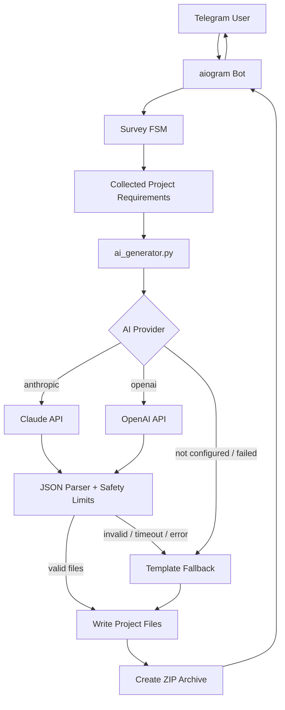

# AI Creator

[](https://github.com/yersaskarov/ai-creator/actions/workflows/tests.yml)

AI Creator is a Telegram bot that turns a short product questionnaire into a ready-to-run starter project packaged as a ZIP archive.

It supports Claude-powered project generation, a safe template fallback mode, Python and JavaScript/TypeScript starters, and basic safety checks around AI-generated files.

## Project Overview

AI Creator is built for beginners and solo builders who want a practical project scaffold instead of a long text answer. The user answers a guided Telegram survey, chooses a project type, language, hosting preference, and AI model, then receives a ZIP archive with source files, dependency files, `.env.example`, prompts, and a README.

The project currently works as an MVP:

- If Claude/OpenAI is configured, AI Creator asks the model to generate a compact starter project.
- If AI generation fails, times out, returns invalid JSON, or is not configured, the bot falls back to safe built-in templates.
- Generated files are validated before being written to disk.
- The final project is sent to the user as a Telegram document.

## Features

- Telegram bot built with `aiogram 3`.
- Guided FSM questionnaire for project requirements.
- Claude API support through the Anthropic SDK.
- OpenAI provider layer is present and can be configured.
- Template fallback mode for safe project generation.
- Python and JavaScript/TypeScript starter projects.
- ZIP export delivered directly in Telegram.
- Basic validation for AI-generated output:
  - JSON parsing guard.
  - Path traversal protection.
  - Maximum file count.
  - Maximum file size.
- Configurable AI timeout.
- Unit tests for parser, path safety, limits, filename sanitization, and template prompt selection.

## Architecture Diagram



## Project Structure

```text
.
|-- ai_generator.py       # AI provider integration and generated-file validation
|-- bot.py                # Telegram bot, FSM flow, ZIP creation, fallback handling
|-- templates.py          # Built-in fallback project templates
|-- requirements.txt      # Runtime dependencies
|-- requirements-dev.txt  # Development/test dependencies
|-- tests/                # Unit tests
|-- .env.example          # Safe environment variable template
`-- README.md
```

## Screenshots

Screenshots are planned for the next showcase pass.

Recommended screenshots to add:

- Telegram `/start` screen.
- Project questionnaire flow.
- Successful AI-mode ZIP response.
- Generated project file tree.
- Example generated `README.md`.

## Installation

```bash
python -m venv venv
venv\Scripts\activate
pip install -r requirements.txt
```

On macOS or Linux:

```bash
source venv/bin/activate
pip install -r requirements.txt
```

For local development and tests:

```bash
pip install -r requirements-dev.txt
```

## Configuration

Copy `.env.example` to `.env` and fill in the values you need:

```bash
TELEGRAM_BOT_TOKEN=
AI_CREATOR_PROVIDER=
AI_GENERATION_TIMEOUT_SECONDS=120
OPENAI_API_KEY=
OPENAI_MODEL=gpt-4.1-mini
ANTHROPIC_API_KEY=
ANTHROPIC_MODEL=claude-sonnet-4-6
ANTHROPIC_MAX_TOKENS=8000
```

Environment variables:

- `TELEGRAM_BOT_TOKEN`: required Telegram bot token from BotFather.
- `AI_CREATOR_PROVIDER`: optional AI provider. Supported values are `openai` and `anthropic`.
- `AI_GENERATION_TIMEOUT_SECONDS`: optional timeout before falling back to templates.
- `OPENAI_API_KEY`: required only when `AI_CREATOR_PROVIDER=openai`.
- `OPENAI_MODEL`: optional OpenAI model override.
- `ANTHROPIC_API_KEY`: required only when `AI_CREATOR_PROVIDER=anthropic`.
- `ANTHROPIC_MODEL`: optional Anthropic model override.
- `ANTHROPIC_MAX_TOKENS`: optional max output token limit for Anthropic generation.

If no AI provider is configured, AI Creator uses built-in templates.

## Running

```bash
python bot.py
```

Then open the bot in Telegram and send:

```text
/start
```

## Docker

Build the image:

```bash
docker build -t ai-creator .
```

Run the bot with environment variables from `.env`:

```bash
docker run --env-file .env ai-creator
```

The container starts the Telegram bot with:

```bash
python bot.py
```

## Testing

Run syntax checks:

```bash
python -m py_compile bot.py ai_generator.py templates.py
```

Run the unit test suite:

```bash
pytest
```

Current tests cover:

- Safe relative path validation.
- JSON parsing for AI-generated files.
- Maximum AI file count.
- Maximum AI file size.
- Project folder name sanitization.
- Prompt-file inclusion rules for template projects.

The tests do not call Claude/OpenAI and do not require real API keys.

## Deployment

For a simple VPS deployment:

1. Clone the repository.
2. Create a `.env` file from `.env.example`.
3. Install dependencies with `pip install -r requirements.txt`.
4. Run the bot with `python bot.py`.
5. Use a process manager such as `systemd`, `supervisor`, or Docker restart policies for long-running usage.

Production deployment still needs persistent FSM storage, structured logs, monitoring, and rate limits.

## Security

Never commit `.env`. It may contain real Telegram, OpenAI, or Anthropic tokens. This repository includes `.env.example` only as a safe template with empty secret values.

AI Creator includes basic safety checks:

- `.env`, virtual environments, generated projects, caches, and ZIP archives are ignored by Git.
- AI-generated paths are normalized and checked against path traversal.
- AI output is limited by file count and file size.
- Invalid JSON from an AI provider triggers fallback mode instead of crashing the bot.

Important limitation: generated code should still be reviewed before running. AI Creator creates starter projects, not audited production systems.

## Roadmap

- Add persistent FSM storage for production deployments.
- Add Dockerfile and deployment documentation.
- Add GitHub Actions for syntax checks and unit tests.
- Add structured logging for AI fallback reasons.
- Add user-level rate limits and generation quotas.
- Add background job queue for long-running AI generation.
- Add screenshots and demo GIFs.
- Add generated-project preview before ZIP delivery.
- Add more templates and provider-specific generation strategies.

## Roadmap v0.3

- Add CI with GitHub Actions.
- Add Docker support.
- Improve GitHub showcase documentation.
- Keep the current Claude/OpenAI generation flow stable.
- Preserve template fallback as the safe default.
- Prepare the codebase for future extraction of project-building services.

## Project Status

AI Creator is an early MVP and portfolio project. It is functional enough to generate real starter projects through Claude, but production use still needs persistent state, deployment hardening, monitoring, rate limiting, and stronger validation of generated code.
